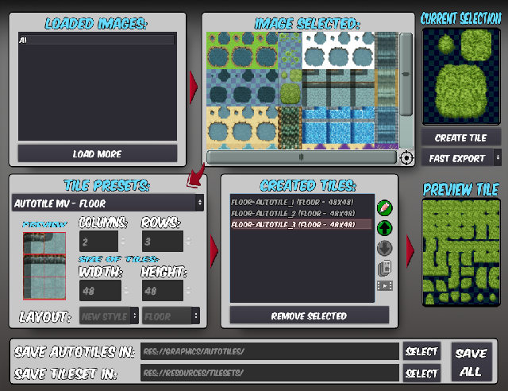

# AutotilesEditor

Convert tilesets, autotiles and autotiles animated from RPG Maker to tilesets of Godot

A simple demonstration video: https://www.youtube.com/watch?v=YMDOobC4Jyg

## Compatibility

Plugin version: Godot v3.2 

## Features:

* Create a whole tileset with 1 click
* Create individual autotiles
* Create Autotiles animated
* Create single tiles / single animated tiles

## Installation:

You'll need the Godot Engine to run this.

To use AutotilesEditor as an Addon:

1. Copy the "addons" folder to your project.
2. Enable **Create Autotile from RPG Makers tilesets** addon on "Project Settings".
3. Now will appear a new item menu in "Project/Tools" called **Autotile Editor** and you can click it to open the Autotiles Editor.

Done!

## Updates:

* 12/07/2020:
	* Setup of the finished project on GitHub.

## License:

MIT License.
